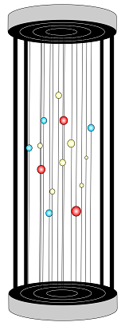

# ProAstronomía Cuba
## Proyectos de Proastronomía

### 1. Maqueta de estrellas cercanas

De momento, tenemos un primer proyecto que es la fabricación de una **Maqueta de estrellas cercanas** en la vecindad del sol como un objeto educativo, que puede ser usado en una clase o en un museo.

La idea es trabajar con una biblioteca profesional de Python para uso astronómico `astroPy` con el objetivo de propiciar el desarrollo de conocimientos de astrofísica y habilidades elementales de trabajo con datos reales. Para ello, deberán procesar los datos necesarios a partir de un *dataset* obtenido de un catálogo astronómico real.

Se utilizará como base la [muestra de estrellas cercanas en la vecindad de 10 pc](<./catalog/The10pcSample.csv>)  generada por el equipo del Telescopio Espacial Gaia. Ver artículo (publicado por Reylé et al.), *The 10 parsec sample in the* Gaia *era* disponible en: [https://www.aanda.org/articles/aa/pdf/2021/06/aa40985-21.pdf](<https://www.aanda.org/articles/aa/pdf/2021/06/aa40985-21.pdf>), [https://gruze.org/10pc/resources/images/The10pcSample.pdf](<https://gruze.org/10pc/resources/images/The10pcSample.pdf>) o en [este mismo repositorio](<./catalog/The10pcSample.pdf>).

#### Recomendaciones sobre el catálogo y su procesamiento

Se toma este material de base este catálogo porque está actualizado (23 de abril de 2021), es sencillo, pequeño y contiene todos los parámetros necesarios. El catálogo puede obtenerse interactivamente por otras vías (p. ej. usando `astroquery`), pero, puesto que está previamente publicado como un archivo y es de pequeñas dimensiones, se simplifica el trabajo y puede utilizarse incluso una copia local para trabajar sin acceso a internet. En el repositorio se encuentra una copia local del catálogo original en dos formatos:

- [CSV](<./catalog/The10pcSample.csv>) (valores separados por comas)
- [MS Excel](<./catalog/The10pcSample.xlsx>)  (hoja de cálculo)

El [Readme](<./catalog/The10pcSample.ReadMe.txt>) original del catálogo también está disponible. Contiene información sumaria sobre las columnas y otros detalles de interés. Más detalles pueden encontrarse en el artículo citado previamente en [este repositorio.](<./catalog/The%2010%20parsec%20sample%20in%20the%20Gaia%20era%20-%20Reyl%C3%A9%2C%20C.%20%26%20P.%20%26%20Caballero%2C%20J.%20A.%20%26%20Smart%2C%20R.%20L.%20%26%20Sozzetti%2C%20A_.pdf>).

**Antes de seguir adelante, es conveniente una revisión y familiarización con estos materiales, para entender el significado astrofísico de los datos que contiene el catálogo de estrellas cercanas de Gaia y qué uso puede hacerse de ellos.**

La exploración del catálogo, para familiarizarse con las columnas y los valores, e incluso el procesamiento y la graficación final pueden realizarse directamente sobre el documento de Excel (con programación), pero para la experiencia colaborativa, se recomienda el trabajo a partir del archivo programado en Jupyter (Python interactivo), accesible en este repositorio como [maqueta_estrellas_cercanas.ipynb](<./maqueta_estrellas_cercanas.ipynb>). Este documento solo plantea el problema y presenta las posibilidades de la biblioteca `astroPy`. El problema no queda resuelto, de manera deliberada, puesto que se propone una búsqueda colaborativa de la solución o, incluso, soluciones según versiones adaptadas a la implementación de cada grupo o individuo participante, tal como sucede en la vida real.  

#### Columnas de interés del catálogo y su posible representación

El catálogo provee las coordenadas heliocéntricas de los objetos (*AR* y *d*, así como el vector de movimiento propio y la época de las coordenadas que se consignan). También contiene el ángulo de paralaje, que se requiere para obtener la distancia a cada objeto. Esto implica una representación en coordenadas polares (con centro en el Sol) que deben convertirse a coordenadas cartesianas con una reducción a escala, para la construcción de la maqueta.

Un primer punto de discusión serían las dimensiones del objeto final (lo mismo podría concebirse como una escultura monumental en un vestíbulo o como un objeto pequeño para colocar en una vitrina o en una mesa). De ellas puede depender la consideración de la escala y de la cantidad de sistemas estelares que se van a representar en la maqueta, o lo que es lo mismo, la distancia de corte del sub-catálogo a procesar, que corresponde al diámetro de una esfera imaginaria con centro en el Sol que contiene todos los sistemas estelares de interés.

En el catálogo, cada fila es una estrella, un objeto sub-estelar o un planeta, y los miembros de los mismos sistemas estelares comparten un identificador común (ver detalles en la documentación). Para cada sistema estelar se necesita obtener del catálogo, o calcular, una serie de parámetros que serán las propiedades de pequeñas esferas colocadas a diferentes alturas en un tensor vertical, como se muestra en la figura anterior (se admiten otras soluciones de diseño con una propuesta de ejecución factible, o incluso soluciones completamente virtuales e interactivas):

- posición en la representación heliocéntrica (¿se puede despreciar el movimiento propio y la época de la posición representada en el catálogo o es necesario considerar estas variables? Demostrar).
  - altura sobre la base (si se elige tensores verticales: (*htensor* / 2) + *z* , donde *h* : longitud del tensor 
  - coordenada cartesiana en el plano de la base (*x*, *y*)
- color (según la clase espectral, a partir de las magnitudes calibradas por los datos de los sensores de Gaia).
- tamaño de la esfera (¿luminosidad, tamaño de la estrella?).
- otros parámetros a representar que requieren consideración:
  - multiplicidad de estrellas del sistema estelar a representar (si acaso coinciden en un mismo punto).
  - cantidad de planetas (¿condición de habitabilidad?). Pueden, por ejemplo, ser un número alfileres con cabeza, clavados en cada esfera, o simplemente información en forma de leyenda).

#### Recomendaciones organizativas para el taller con un propósito docente

Conformar un grupo, ya sea integrado por participantes individuales o por subgrupos, que se asociarán según sus roles preferidos (posiblemente relacionados también con su especialidad de proveniencia, si fuera el caso). Para el proyecto, se necesita de las siguientes especialidades y tareas a resolver:

1. **Gestión de la información**: Conseguir información en la red (artículos, tutoriales, códigos fuentes) , traducirla, si es necesario, y ponerla al alcance del equipo. Gestionar los espacios digitales donde se actualice información sobre el desarrollo del proyecto. Conformar la documentación de uso del prototipo en las plataformas que se decida.
2. **Astronomía, astrofísica y astrobiología**: Estudiar las áreas de interés de las disciplinas implicadas, tales como astrometría (transformaciones de unidades, cambio de sistemas de coordenadas, movimiento propio y época), fotometría (conversión entre los datos de sensor del satélite en el catálogo y los sistemas fotométricos estándar), astrofísica estelar (luminosidad, clases espectrales), astrobiología (sistemas planetarios, habitabilidad), historia de la astronomía (condiciones de descubrimiento y origen del nombre de los objetos a considerar).
3. **Programación**: Estudiar las bibliotecas necesarias para el proyecto. Estudiar la estructura del catálogo. Concebir los algoritmos y estructuras de datos. Programar las transformaciones de los parámetros físicos de los objetos y la graficación de los bocetos de la maqueta.
4. **Diseño**: Discutir las mejores maneras de representar las variables del catálogo en un objeto museal. Serán admisibles otras formas de interactividad, ya sea en la propia maqueta, en soportes digitales que la acompañen o independientes, según la creatividad y la experiencia previa que aporten los miembros del equipo.
5. **Desarrollo**: Proveer las soluciones técnicas y los materiales para elaborar los planos para la construcción del prototipo. Eventualmente, construir la maqueta, aplicaciones digitales, etc. .
7. **Estudio de los objetos del catálogo y documentación**: El empleo del resultado como medio educativo requerirá cosechar documentación sobre los sistemas estelares y planetarios, habitabilidad, condiciones de descubrimiento, curiosidades, bibliografía (el catálogo brinda ya alguna). Esta información, no solo es de interés para el equipo, sino también para la documentación que se elabore para el público o para representar en posibles soluciones interactivas.
8. **Coordinación del proyecto**: Garantizar la comunicación y arbitrar en las decisiones colectivas entre los equipos y establecerá los tiempos para que se cumplan las subtareas.      

Es evidente que ningún equipo puede trabajar por separado. La toma de decisiones en un área implica la consulta de dominios investigados y decisiones tomadas por otras áreas. Estas, a su vez, pueden necesitar pasar los resultados del trabajo de otra área para garantizar la continuidad de la tarea, que, en todo caso, debe enfrentarse como un trabajo colectivo, tal como sucede en los proyectos de la vida real.

Se aspirará a culminar el proyecto en dos fases. 

- La primera espera obtener los planos y listados de materiales, así como los materiales de base que permitan elaborar una documentación para su uso. Esta fase es obligatoria para haber vencido la tarea.

- La segunda tiene como objetivo la fabricación del prototipo y la producción de a documentación para su uso. Esta fase es opcional, puesto que puede demandar financiamiento para obtener los materiales necesarios, pero se estimula su culminación, que será premiada por la obtención de un objeto funcional, científicamente elaborado.

#### Referencias

##### Astrofísica

[*Astrophysics is Easy. An Introduction to the Amateur Astronomer* de Brian Inglis](<https://archive.org/download/AstrophysicsIsEasyAnIntroductionToTheAmateurAstronomer/AstrophysicsIsEasy.pdf>).

Este libro es introductorio pero trata todos los tópicos básicos de la astrofísica y estimula la observación de los objetos que se van estudiando a modo de ejemplo. Muy recomendable. Existen dos ediciones, pero, a los efectos de este proyecto, cualquiera es útil.

##### Programación

- [Curso de Python para Astronomía. Instituto de Astrofísica de Canarias](<http://research.iac.es/sieinvens/python-course/>).
- [Practical Python for Astronomers Tutorial](<http://python4astronomers.github.com/>).
- [Astropy (Documentación oficial de la biblioteca Astropy)](<http://docs.astropy.org/>).
- [Learn Astropy : Home (Documentación de la biblioteca Astropy)](<https://learn.astropy.org/>).
- [Astropy Tutorials](<https://github.com/astropy/astropy-tutorials/>).

### 2. Otros proyectos... (en desarrollo)

### Contacto:

La participación en el proyecto y las discusiones se atenderán por el grupo de Telegram de ProAstronomía Cuba: [http://t.me/ProAstronomia](<http://t.me/ProAstronomia>).

Se solicita colaboración para la administración de este repositorio en GitHub. También pueden dirigirse a mi correo ajimper@gmail.com .
